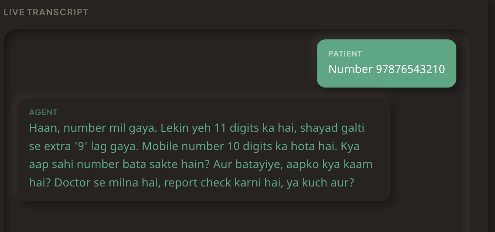

Scenario 1 : I want immediate results. 

Patient
मुझे डॉक्टर से मिलना है, मेरे पेट में बहुत दर्द हो रहा है।
Agent
Samajh gaya, pet mein bahut zyada dard ho raha hai toh yeh toh takleef ki baat hai. Aapka naam aur registered phone number bataiye, aur confirm kijiye ki pet mein dard hi main problem hai?
Patient
मेरा नाम अर्जुन मेहता है, मेरा नंबर है 999999999।
Agent
Samajh gaya Arjun ji. Pet ka dard bahut zyada hai, toh urgent basis par general physician se appointment lagate hain. Main aapke liye slot dhundh raha hoon.
Patient
ठीक है।
Agent
{ "reply": "ठीक है अर्जुन जी। मैं आपके लिए सामान्य चिकित्सक से तत्काल नियुक्ति बुक करवा रही हूँ। आपको 15-20 मिनट में कॉल किया जाएगा।

Scenario 2 : Replied very late the first time
Session
HSP-5375
Duration
01:04
Language
Marathi
Live Transcript

रुग्ण
मला अंजली देशमुख यांची अपॉइंटमेंट घ्यायची आहे. 
almost waited 30 seconds
रुग्ण
मला अंजली देशमुख यांची अपॉइंटमेंट घ्यायची आहे.
एजेंट
अंजलि देशमुख, समजले. तुमचा नोंदणीकृत दूरध्वनी क्रमांक आणि तुम्ही कोणत्या समस्येचा सामना करत आहात ते सांगा.

Something went wrong after last message specified the second time & also did not verify the intent of booking 

रुग्ण
मला अंजली देशमुख यांची अपॉइंटमेंट घ्यायची आहे.
रुग्ण
Okay
रुग्ण
Okay
एजेंट
नक्कीच. तुमचे नाव आणि नोंदणीकृत दूरध्वनी क्रमांक सांगाल का? मी तुमच्यासाठी appointment बुक करते, अंजली देशपांडे.
रुग्ण
माझा नंबर आहे नाईन एट सेव्हन सिक्स फाईव्ह फोर थ्री टू वन टू.
एजेंट
येथे उपलब्ध जागा आहेत: - डॉ. प्रिया शर्मा, सामान्य, 09:00 डॉ. प्रिया शर्मा, सामान्य, 10:00 डॉ. प्रिया शर्मा, सामान्य, 11:00
रुग्ण
सामान्य आकरा ठीक आहे.

Scenario 3 
got stuck after this for a minute and did not respond 
Patient
मेरी दवाई के बारे में पूछना था, मेरा नंबर है 9876543210।
Agent
हाँ जी, मैं आपकी दवाई के बारे में मदद कर सकता हूँ। आपका नाम और कौन सी दवाई के बारे में पूछना है, ये बताइए?
Patient
मेरा नाम रमेश कुमार है, मुझे सारी दवाइयों के बारे में पूछना है।
Agent
ठीक है रमेश जी। आपके पास जो जानकारी है, वो काफी है। मैं आपके सभी दवाओं की जानकारी चेक करता हूँ। क्या आप बता सकते हैं कि आप कौन सी दवाई के बारे में जानना चाहते हैं, या फिर पूरी लिस्ट देखनी है?
Patient
पूरी लिस्ट देखनी है।

Scenario 4 — Lab Report Ready, Hindi - Went well

